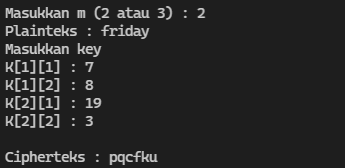
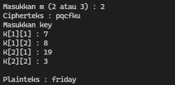
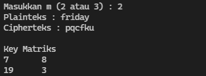
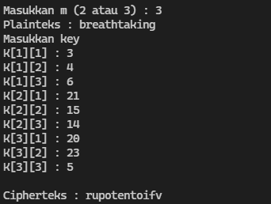
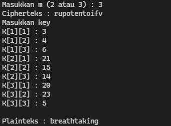
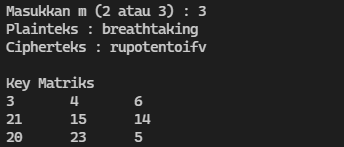

# SHIFT CIPHER

---

| Nama                            | NPM            |
| ------------------------------- | -------------- |
| Muhammad Luthfi Taufiqurrahman  | 140810190036   |
| Gregorius Evangelist Wijayanto  | 140810190040   |
| Ihsanuddin Dwi Prasetyo         | 140810190048   |

---

### Screenshot Program

**Ordo matriks kunci 2x2 (m = 2)**
1. Enkripsi
  
  

2. Dekripsi
  
  

3. Matriks kunci
  
  

**Ordo matriks kunci 3x3 (m = 3)**
1. Enkripsi
  
  

2. Dekripsi
  
  

3. Matriks kunci
  
  
